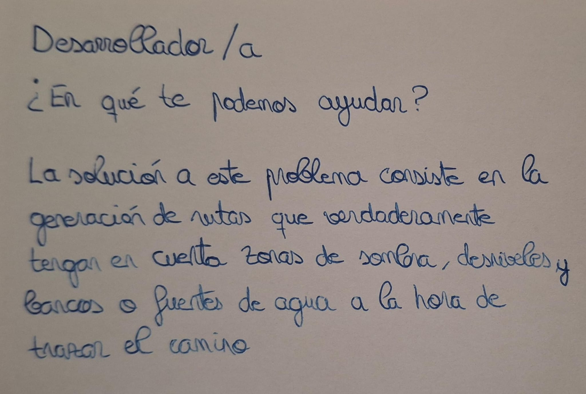

# Analizador de Sombras

*Proyecto realizado por Jaime Rojas Herrera*

### Descripción del Problema

Este verano, caminando por mi pueblo para ir a la panadería, cerca de las 14:00, observé la poca cantidad de zonas con sombra que hay durante mi trayecto. La verdad es que no sé si se podría llegar a la panadería desde otros sitios para aprovechar más zonas cubiertas del sol y así sufrir un poco menos el calor. Mi padre, por ejemplo, ya se conoce todas las calles de memoría y sabe por qué callejuelas rondar para encontrar árboles o edificios que le cubran del sol.

### Juego de Rol

- 
- 
- 

### Configuración Previa Realizada

- [Captura de la configuración de SSH](ssh.png)
- [Captura de la configuración de GIT con nombre y email](config.png)

### Lista de Comprobación ¿Cumple el problema con lo requerido?

#### ¿Se trata de un problema real del que se tenga conocimiento personal?

Sí, yo mismo acuso este problema a la hora de salir a la calle.

#### ¿Se trata de un problema que para solucionar requiera el despliegue de una aplicación en la nube?

Correcto, lo lógico es que varias personas quieran consultar esta información en un momento puntual. Los procesos de generación de sombras pueden ser pesados y centralizar ese cálculo en un servicio desplegado en la nube es esencial para evitar instalaciones o problemas en cada teléfono/dispositivo que vaya a hacer uso de la aplicación.

#### ¿La solución requiere una cierta cantidad de lógica de negocio, en vez de solucionarse sólo almacenando y buscando?

Efectivamente. Habría que analizar que zonas están cubiertas del sol durante el mayor tiempo posible y las horas en las que las zonas de sombra aparecen en ciertas calles. Con esta información, sugerir al usuario rutas alternativas con mayor tiempo de sombra para ir al mismo destino.

#### ¿Se ha incluido la configuración del repositorio y se ha enlazado desde el `README`?

Sí, por supuesto. La configuración se encuentra arriba. También se ha enlazado con las fotografías del juego de rol.

#### ¿El estudiante tiene todos los datos necesarios para poder resolver el problema, o va a requerir que el usuario los introduzca?

Sí, con Catastro se pueden descargar todos los datos referentes a la altura de los edificios y la posición del sol se puede saber a partir de la fecha, hora y coordenadas. En OpenStreetMap también se recoge información sobre los edificios y árboles, que se pueden incluir en el cálculo de las sombras. Desniveles o cornisas no se tendrán en cuenta para generar las zonas con sombra.

