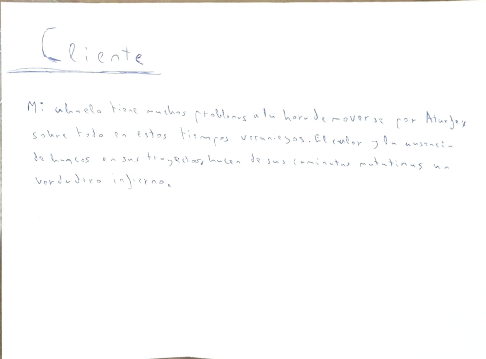

# Analizador de Sombras

*Proyecto realizado por Jaime Rojas Herrera*

### Descripción del Problema

Este verano, caminando por mi pueblo para ir a la panadería, cerca de las 14:00, observé la poca cantidad de zonas con sombra que hay durante mi trayecto. La verdad es que no sé si se podría llegar a la panadería desde otros sitios para aprovechar más zonas cubiertas del sol y así sufrir un poco menos el calor. Mi padre, por ejemplo, ya se conoce todas las calles de memoría y sabe por qué sitios debe ir. Suele intentar pasar por calles con numerosos árboles, que le proporcionan cobijo frente al sol. También trata de pegarse a las calles con edificios altos, que dan mucha sombra a ciertas horas del día. Por último, en días con un sol radiante, trata de ir por calles lo más estrechas posibles, pues estas suelen estar a menor temperatura (les ha dado menos el sol). Sin embargo, yo no soy mi padre y la verdad es que con estas temperaturas cada vez cuesta más salir a la calle a hacer recados.

### Juego de Rol

- 
- 

### Configuración Previa Realizada

- [Captura de la configuración de SSH](ssh.png)
- [Captura de la configuración de GIT con nombre y email](config.png)

### Lista de Comprobación ¿Cumple el problema con lo requerido?

#### ¿Se trata de un problema real del que se tenga conocimiento personal?

Sí, yo mismo acuso este problema a la hora de salir a la calle.

#### ¿Se trata de un problema que para solucionar requiera el despliegue de una aplicación en la nube?

Correcto, lo lógico es que varias personas quieran consultar esta información en un momento puntual. Los procesos de generación de sombras pueden ser pesados y centralizar ese cálculo en un servicio desplegado en la nube es esencial para evitar instalaciones o problemas en cada teléfono/dispositivo que vaya a hacer uso de la aplicación.

#### ¿La solución requiere una cierta cantidad de lógica de negocio, en vez de solucionarse sólo almacenando y buscando?

Efectivamente. Habría que analizar las estrategias seguidas por mi padre. Extraer el número de árboles en cada calle para tenerlo en cuenta a la hora de trazar las rutas (tendrían preferencia calles con mayor número de árboles). Analizar la altura de los edificios de los dos lados de la calle y quedarse con el lado de mayor altura media por edificio (por poner un ejemplo). Calcular la anchura de las calles para ver las más estrechas, que tendrán prioridad en el momento de elegir la ruta. Todos esos aspectos unidos, junto al cálculo de las zonas de sombra según la posición del sol (claramente, si el sol no está en una posición en la que de sombra, los edificios, por muy altos que sean, no la darían), se usaría a la hora de generar las mejores rutas posibles.

#### ¿Se ha incluido la configuración del repositorio y se ha enlazado desde el `README`?

Sí, por supuesto. La configuración se encuentra arriba. También se ha enlazado con las fotografías del juego de rol.

#### ¿El estudiante tiene todos los datos necesarios para poder resolver el problema, o va a requerir que el usuario los introduzca?

Sí, con Catastro se pueden descargar todos los datos referentes a la altura de los edificios y la posición del sol se puede saber a partir de la fecha, hora y coordenadas. En OpenStreetMap también se recoge información sobre los edificios y árboles, que se pueden incluir en el cálculo de las sombras. Desniveles o cornisas no se tendrán en cuenta para generar las zonas con sombra. Los árboles tienen etiquetas para ver si se encuentran en una calle, lo que facilitaría algo las cosas. La anchura de las calles no está disponible, pero se podría hacer una estimación al saber el tipo o incluso calcularla geométricamente.

